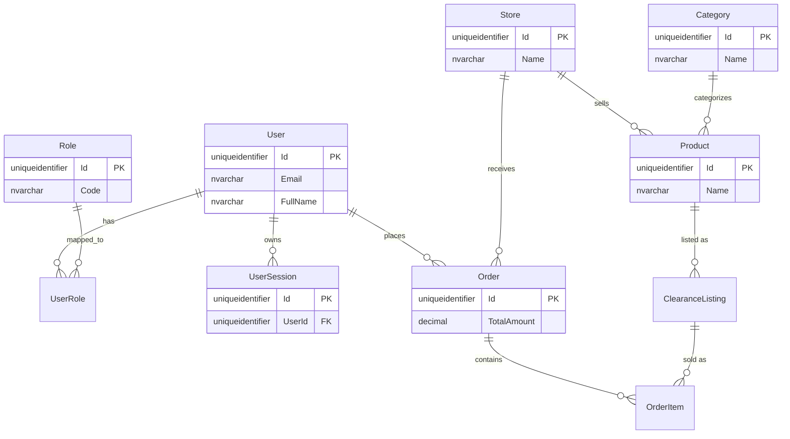

# SaveFood Backend

Dự án **SaveFood** là nền tảng Web Marketplace chuyên bán đồ ăn cận date nhằm mục đích giảm thiểu lãng phí thực phẩm. Đây là mã nguồn Backend (API) của hệ thống.

Dự án này sử dụng kiến trúc **N-Tier Architecture** kết hợp với mô hình **Database-First** (Entity Framework Core) và hướng tới Clean Architecture để tách biệt rõ ràng các tầng nghiệp vụ.

---

## 1. Công nghệ sử dụng
- **Framework**: .NET 8 (ASP.NET Core Web API)
- **Database**: SQL Server
- **ORM**: Entity Framework Core 8.0
- **Authentication**: JWT (JSON Web Tokens)
- **Thanh toán**: payOS
- **Lưu trữ ảnh**: Cloudinary
- **Gửi Email**: MailKit (SMTP)
- **Real-time**: SignalR (WebSockets)

---

## 2. Các Module và Bảng dữ liệu cốt lõi
Qua việc phân tích toàn bộ source code (`DbContext`, `Controllers`, `Services`), hệ thống được chia thành các phân hệ chính sau:

1. **Phân hệ Người dùng & Xác thực (Auth & Users)**: `Users`, `Roles`, `UserRoles`, `UserSessions`, `PasswordResetTokens`, `EmailVerifications`.
2. **Phân hệ Cửa hàng (Stores)**: `Stores`, `StoreStaffs` (Quản lý nhân viên quán), `SubscriptionPlans` (Gói cước), `StoreSubscriptions` (Đăng ký gói).
3. **Phân hệ Sản phẩm & Tin đăng (Products & Listings)**: `Categories`, `Products`, `ProductImages`, `ClearanceListings` (Lô hàng cận date thực tế bán), `ListingImages`, `ListingDiscountRules` (Cấu hình tự động giảm giá cận giờ).
4. **Phân hệ Đặt hàng (Orders)**: `Carts`, `CartItems` (Giỏ hàng), `Orders`, `OrderItems` (Chi tiết đơn), `Payments` (Thanh toán).
5. **Phân hệ Tài chính & Ví (Wallets)**: `StoreWallets`, `CustomerWallets`, `WalletTransactions`, `CustomerWalletTransactions`, `WithdrawalRequests` (Yêu cầu rút tiền).
6. **Phân hệ Đánh giá (Reviews)**: `Reviews`, `ReviewImages` (Khách hàng đánh giá đơn).

---

## 3. Các Background Tasks (Tiến trình chạy ngầm)
- `DynamicPricingBackgroundService`: Tự động quyét và giảm giá (`SalePrice`) các tin đăng (ClearanceListing) dựa vào `ListingDiscountRules` khi gần đến giờ hết hạn.
- `ExpiredOrderCleanupService`: Tự động hủy các đơn hàng chưa thanh toán quá hạn (Pending payment timeout).
- `NoShowOrderCompletionService`: Tự động đánh dấu hoàn thành các đơn đã thanh toán online nhưng khách không đến lấy (No Show) sau khoảng thời gian nhất định, để tránh tiền bị treo.

---

## 4. Hướng dẫn Cài đặt & Chạy dự án

### Yêu cầu hệ thống (Prerequisites)
- Cài đặt [.NET 8 SDK](https://dotnet.microsoft.com/en-us/download/dotnet/8.0).
- Cài đặt [SQL Server](https://www.microsoft.com/en-us/sql-server/sql-server-downloads) và SSMS (hoặc Azure Data Studio).
- Cài đặt EF Core CLI: `dotnet tool install --global dotnet-ef`

### Cấu hình môi trường (appsettings.json)
Bạn cần cấu hình file `appsettings.json` (hoặc `appsettings.Development.json`) trước khi chạy:

```json
{
  "ConnectionStrings": {
    "DefaultConnection": "Server=localhost;Database=SaveFoodDB_MVP;Trusted_Connection=True;TrustServerCertificate=True;"
  },
  "Jwt": {
    "Key": "SaveFood_Super_Secret_Key_For_JWT_Authentication_12345!@#",
    "Issuer": "SaveFoodBackend",
    "Audience": "SaveFoodFrontend"
  },
  "SmtpSettings": {
    "Username": "your_email@gmail.com",
    "Password": "your_app_password"
  },
  "Cloudinary": {
    "CloudName": "your_cloud_name",
    "ApiKey": "your_api_key",
    "ApiSecret": "your_api_secret"
  }
}
```

### Chạy Database Migration
Vì dự án dùng Entity Framework Core, bạn cần cập nhật CSDL:

```bash
# Trỏ đường dẫn vào thư mục chứa project
cd SaveFoodBackend

# Chạy lệnh update database
dotnet ef database update
```

### Khởi chạy Server
Để chạy API Server:

```bash
dotnet run
```
Truy cập `https://localhost:<port>/swagger` để xem giao diện tài liệu API (Swagger UI). Lưu ý SignalR sẽ lắng nghe tại endpoint `/hubs/notifications`.

---

## 5. Cấu trúc thư mục (Clean Architecture / N-Tier)

- **`/Controllers`**: Chứa các API Endpoints (Ví dụ: `UsersController`, `OrdersController`). Controller chỉ nhận request, thực hiện validate DTO, và gọi `IService`.
- **`/Interfaces`**: Định nghĩa các Interface hợp đồng cho Repository và Service, tuân thủ Dependency Inversion (DI).
- **`/Services`**: Tầng chứa toàn bộ logic nghiệp vụ (Ví dụ: `OrderService.CheckoutAsync` xử lý tồn kho, `AuthService.LoginAsync` sinh JWT).
- **`/Repositories`**: Nơi thao tác trực tiếp với `DbContext`. Che giấu (Abstract) việc truy xuất Data khỏi Service.
- **`/Models`**: File entities ánh xạ với bảng SQL Server. Được sinh tự động (Scaffold).
- **`/DTOs`**: Chứa các class Data Transfer Object định nghĩa Request/Response Payload cho API.
- **`/BackgroundTasks`**: Chứa các HostedServices (Workers) chạy định kỳ hoặc liên tục.
- **`/Hubs`**: Cấu hình WebSockets (SignalR) bắn thông báo thời gian thực.
- **`/Extensions`**: Cấu hình Dependency Injection, Swagger, CORS, JWT cho `Program.cs`.
- **`/Middleware`**: Chứa `GlobalExceptionMiddleware` để bắt lỗi toàn cục và format chuẩn API Response.

---

## 6. Sơ đồ Thực thể - Liên kết (ERD Diagram)


