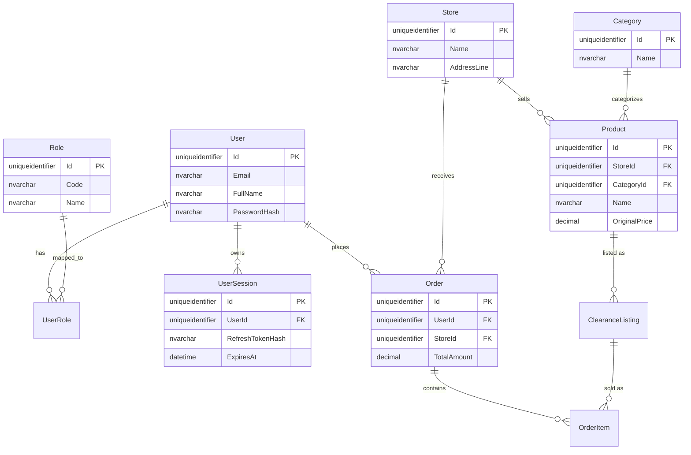

# Dự án SaveFood Backend - Cấu trúc & Quy chuẩn Team (Tuần 2)

Dự án này sử dụng kiến trúc **N-Tier Architecture** kết hợp với mô hình **Database-First** (Entity Framework Core).

## 1. Cấu trúc thư mục (Project Structure)
Dưới đây là cấu trúc chính của project để 5 thành viên trong team dễ dàng follow và tránh gây conflict code:

- **`/Models`**: File entities được sinh ra tự động bằng lệnh `Scaffold-DbContext` từ SQL Server. **TUYỆT ĐỐI KHÔNG SỬA TRỰC TIẾP** các file trong đây vì nếu chạy lại lệnh scaffold sẽ bị mất code. Nếu cần thêm logic, hãy dùng file partial ở thư mục `/Models/Partials/`.
- **`/DTOs`** (Data Transfer Objects): Chứa các class trung gian để trao đổi dữ liệu giữa Frontend và Backend. Cấu trúc gợi ý:
  - `/DTOs/Auth`: Chứa LoginRequest, RegisterRequest, v.v.
  - `/DTOs/User`: Chứa UserProfileDTO, UpdateProfileRequest, v.v.
- **`/Interfaces`**: Định nghĩa các Interface cho Repository và Service (ví dụ: `IUserService.cs`).
- **`/Services`**: Chứa logic nghiệp vụ (Business Logic). Mọi quy trình xử lý dữ liệu phức tạp phải nằm ở đây thay vì nhét hết vào Controller.
- **`/Repositories`**: (Tùy chọn) Nếu nghiệp vụ gọi DB quá phức tạp, có thể tách riêng Repository, nếu không dùng trực tiếp DbContext trong Service.
- **`/Controllers`**: Chứa các API Endpoints. **Quy chuẩn:** Controller KHÔNG thao tác trực tiếp với Database mà phải gọi thông qua `Service`.
- **`/Extensions`**: Chứa các cấu hình mở rộng cho `Program.cs` (như cấu hình Auth, Swagger, CORS) để tránh file Program quá dài.

## 2. Quy chuẩn Code (Coding Conventions)
- **Tên Class/File**: `PascalCase` (VD: `UserService.cs`, `SaveFoodDbContext.cs`).
- **Tên biến nội bộ/Private properties**: `_camelCase` (VD: `private readonly IUserService _userService;`).
- **Tên biến Method param**: `camelCase` (VD: `string email`).
- **Tên URL API**: `kebab-case` cho đường dẫn (VD: `GET /api/Users/my-profile` thay vì `MyProfile`).

## 3. Sơ đồ Thực thể - Liên kết (ERD Diagram)

Dưới đây là sơ đồ ERD rút gọn được biểu diễn bằng cấu trúc `Mermaid.js`, thể hiện mối quan hệ giữa người dùng, sản phẩm, và cửa hàng.

*(Nếu trình quản lý Git của bạn hỗ trợ Markdown hoặc xem trên GitHub, đoạn code trên sẽ tự động vẽ thành một biểu đồ mạng lưới.)*
